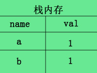

# 学习指南
**先看教程，再记录  
切记不能，边看边记录**


# 参考文章
> * [js 原始类型 w3cschool](http://www.w3school.com.cn/js/pro_js_primitivetypes.asp)
> * [MDN js 原始类型](https://developer.mozilla.org/zh-CN/docs/Web/JavaScript/Data_structures)
> * [js 计算导致精度问题(0.1+0.2)](https://github.com/camsong/blog/issues/9)

## 关键词
**原始类型**、**基础类型**、**引用类型**、**伪对象**、**伪数组**、**伪数组**、**基模式**

> `原始类型`: typeof 可以检测的js 基础类型 (5种)   

Number, String, Boolean, Null, Undefined
Symbol(新增)


> `引用类型`： Object 是引用类型，也称伪复杂类型；     

存储位置： 内存 - 堆 - 指针; 
详细描述： 栈中存的是堆的地址， 堆中存储的是值,；
其他引用类型： Function、 Array 、 Date 、 RegExp 

  
> `伪对象`： 具有 object 的属性；

> `伪数组`： 具有 argument 的索引值, 但不能使用其原型上的方法

伪数组： argument 、 document.getElementsByClass 


# What 🐎

---
## js类型 基础概念是什么？
**javascript 基础类型由 原始类型 和 引用类型 组成** 

### 基础类型 是什么？

`基础类型`: 除引用类型外，都是基础类型
存储：内存里 = 栈(值) 



### 引用类型 是什么？

`引用类型`： 也称伪复杂类型；     

Object 、 Function、 Array 、 Date 、 RegExp 等等；


存储： 内存 = 堆(数据) + 栈(地址);

多种引用类型： Object 、 Function、 Array 、 Date 、 RegExp 等等；

详细描述： 堆中存储的是值, 栈里存的是堆中值地址；


* `Object` 类型： 对象
    * Number、Boolean、String 是 `伪对象`，所以 这3种原始类型有 xxx.toString 一些方法
    * xxx.toString 解决类型强转换报错问题: null/undefined 类型转换
        ```js
        var a = '32'
        a.toString()
        String(a)
        ```


### 伪对象 是什么？
伪对象 一定有 `xxx.toString()` 方法

### 原始类型 是什么？

> Number, String, Boolean, Null, Undefined
Symbol(新增)


#### 原始类型详情
> 原始类型
Number, String, Boolean, Null, Undefined
Symbol(新增)


* `typeof` 运算符： 可以查看 `变量` 属于什么原始类型；  

    


* `String` 类型： 字符类型
    * 伪对象：一定有 `xxx.toString()` 方法；
    * 强类型转换 `String(xxx)`
    * Number、Boolean 是伪对象，所以有 xxx.toString()
    *  **xxx.toString(基模式)**
        ```js
        var num = 3223;
        num.toString(2) // 转二进制；
        num.toString(8) // 转八进制；
        num.toString(10) // 转十进制； // 默认
        num.toString(16) // 转十六进制；
        ```
    * 

* `Number` 类型： 数字类型
    * 伪对象：一定有 `xxx.toString()` 方法；
    * 强类型转换 `Number(xxx)`
    * `NaN == Nan` 为 `true`;
    * 有效值范围
        * 最小值： `Number.MIN_VALUE`
        * 最大值： `Number.MAX_VALUE`
        * 超出最小值： `Number.NEGATIVE_INFINITY`，存储数据，但不再显示数字，显示 `Infinity`, 该值不能再计算;
        * 超出最大值： `Number.POSITIVE_INFINITY`，存储数据，但不再显示数字，显示 `Infinity`, 该值不能再计算;
        * 有效值： `Number.isFinite`
    * 整数：32位
        * parseInt(xxx, 基模式)；
            1. 从字符开始识别到非数字字符
            2. 转成数字
    * 浮点型：64位
        * parsetFloat(xxx, 基模式)：
            1. 使用 parsetFloat 方法，数字字符必须是十进制的；
            2. 从字符开始识别到第一个小数点，转换小数点之前为整数；
            3. 第一个小数点之后的转成小树
    * `Number()` 强类型转换
        1. 识别是否为数字字符；
        2. 之后处理类似 parseInt 和 parseFloat；


        

* `Boolean` 类型： 布尔类型
    * 伪对象：一定有 `xxx.toString()` 方法；
    * 强类型转换 `Boolean(xxx)`


* `Null` 类型：
    * `typeof null` 是 `object`；
        是由于 js 创建之初的错误设计，但它是属于原始类型    
    


* `Undefined` 类型：  v
    * 衍生来源于 Null 类型;
        `undefined == null` 为 `true`
    * 变量未声明，不能使用操作符 (函数/ == / 等等 操作符 )，否则报错 ；
        ```js
        console.log(aaa); // 报错;

        var aaa; 
        console.log(aaa);// 不会报错;
        ```


## 它解决了什么问题?

###  原始类型 注意
* number、string、boolean 都是伪对象，具有对象的属性
* 转换类型，强类型转换比伪类型属性好，因为其 伪类型属性，非 number\string\boolean 会导致报错；
* 基础类型，未声明不能使用操作符；
* 数字类型，整数转换和浮点型转换，转换的结果可能不一样；
* `undefined == null` 为 `true` 是由于 undefined 是衍生于 null 类型；
* typeof null 是 object ，是由于 js 错误设计的问题；
* number\string\boolean 为什么会有属性，是由于他们都是伪对象；

    

###  引用类型 注意
* 引用类型中，除了 `Function`，使用 typeof 判读类型，返回的都是 object 
    ```js
    typeof function(){}; // function;
    typeof Date(); // object
    typeof RegExp(); // object
    ```

    

## 它的实现原理是什么？

> 基础类型 是什么

* 列出来
* 列出来


## 它的缺陷是什么？

> xxx 是什么
* typeof null 是 object


## 对于我有什么帮助？
> xxx 是什么

* 列出来
* 列出来


# How 🔨

---
## 我该如何使用它？
> xxx 如何实现？

* 列出来
* 列出来


## 它的缺点是什么？


## 有没有更好的实现方式呢？
> xxx 如何实现？

* 列出来
* 列出来


# Why  🤔
---
## 为什么需要它(为什么会有该问题)？ 
> 为什么

* 列出来
* 列出来


## 如果我不用它呢？
> 为什么

* 列出来
* 列出来


## 如果是自己来做，你会如何做呢？
> 如何实现？

* 列出来
* 列出来


## 有没有什么类似的工具或方式呢？
> 为什么

* 列出来
* 列出来


## 疑惑 🤔


## 学习掌握概览

等级 | What        | Why                   | How
---|---     | ---                   | ---
- [ ] 初级 [怎么做] | - [ ] 基础概念 | - [ ] 为什么需要它             | - [ ] 基本使用
- [ ] 中级 [为什么] | - [ ] 类比概念 | - [ ] 如果我不用它呢           | - [ ] 有没有什么类似的工具或方式呢
- [ ] 高级 [自己的] | - [ ] 自己概念 | - [ ] 有没有更好的实现方式呢？ | - [ ] 如果是自己来实现，你会如何做呢？


