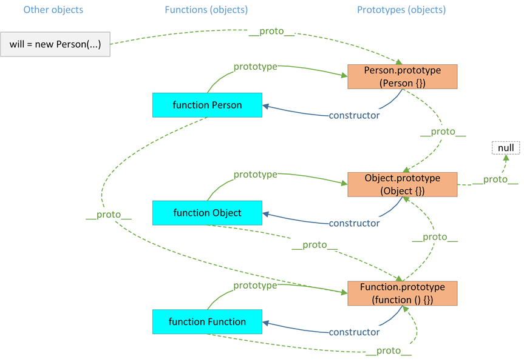

*学习掌握概览*

等级 | What        | Why                   | How
---|---     | ---                   | ---
- [ ] 初级 [怎么做] | - [ ] 基础概念 | - [ ] 为什么需要它             | - [ ] 基本使用
- [ ] 中级 [为什么] | - [ ] 类比概念 | - [ ] 如果我不用它呢           | - [ ] 有没有什么类似的工具或方式呢
- [ ] 高级 [自己的] | - [ ] 自己概念 | - [ ] 有没有更好的实现方式呢？ | - [ ] 如果是自己来实现，你会如何做呢？


# 参考文章
> * [js 多种继承](https://juejin.im/post/58f94c9bb123db411953691b#heading-1)
> * [列出了不同继承的优缺点](http://www.cnblogs.com/humin/p/4556820.html)
> * [Javascript定义类（class）的三种方法(阮一峰)](http://www.ruanyifeng.com/blog/2012/07/three_ways_to_define_a_javascript_class.html)
> * [js instance解释 ](https://developer.mozilla.org/zh-CN/docs/Web/JavaScript/Reference/Operators/instanceof)
> * [JavaScript中原型属性为什么是共享的]([www](https://blog.csdn.net/u012468376/article/details/53121081))
> * [BBB](www)

## 关键词
`关键词1`、`关键词2`、`关键词3`、`关键词4`

关键词1： 解释
关键词2： 解释

 

```javascript
// 工厂模式创建函数
var person = new Person()
person.__proto__ === Person.prototype
person.__proto__.constructor === Person
person.__proto__.constructor.__proto__ === Function.prototype
person.__proto__.constructor.__proto__.constructor === Function


// Object 的原型链
var obj = {}
obj.__proto__ === Object.prototype
obj.__proto__.constructor === Object
obj.__proto__.constructor.__proto__ === Function.prototype
obj.__proto__.constructor.__proto__.constructor === Function
```

# What 🐎

---

## 构造函数和原型函数区别
- 是否需要 new 操作
  - 构造函数: 不是必须
  - 原型函数: 必须使用 `new xxx()`, new 操作返回对象;
- 实例属性是否共享
  - 构造函数的属性和方法: 独立存在的;
  - 原型上的属性和方法: 共享


### 构造函数
适用于: 封装属性需要独立

### 原型属性
适用于: 封装需要共享的属性

## 对象的基本概念

### 原型 prototype 是什么
* 原型是函数的附加属性；
* 原型有 constructor 属性；


### 构造器是什么?
> constructor   
* 定义函数时，JS 引擎会自动为函数添加 两个属性： prototype 和  prototype 的属性 constructor；
* 


#### 注意
⚠️ 当开发者重写 prototype 后，原有的 constructor 引用会丢失

```js
function F(){}
F.prototype = {a:1}
var f1 = new F()
f1.constructor == F; // false
console.log('f1.constructor == F: ', f1.constructor == F);

// !思考为什么这样就可以
F.prototype.constructor = F
var f2 = new F()
console.log('f2.constructor == F : ', f2.constructor == F );
```
#### Object.create 改变对象原型链, 使用传入对象的 contructor
`MDN 解释`: 方法创建一个新对象，使用现有的对象来提供新创建的对象的__proto__
```js
// 例子一: 改变成成和 person 一样的constructor
function Person() {}
var person = new Person()
person.constructor === Object

var xiaoming = Object.create(person)
xiaoming.constructor === person // false
xiaoming.constructor === Person
// 二次解析
person.constructor === Person

// 例子二: 使用 {}
var aa = {a:1}
var bb = Object.create(aa)
bb.constructor === aa // false
bb.constructor === Object
// 二次解析
aa.constructor === Object 

```

### instanceof 
> 判断 对象是否在原型链上  

```js
// [] instanceof Array
console.log('[] instanceof Array: ', [] instanceof Array);

// [] instanceof Object
console.log('[] instanceof Object: ', [] instanceof Object);
```

原因： 
```js
// [].__proto__ == Array.prototype
console.log('[].__proto__ == Array.prototype: ', [].__proto__ == Array.prototype);
// Array.prototype.__proto__ == Object.prototype
console.log('Array.prototype.__proto__ == Object.prototype: ', Array.prototype.__proto__ == Object.prototype);
// Object.prototype.__proto__
console.log('Object.prototype.__proto__: ', Object.prototype.__proto__);
```

[
    import, 
    theme:"monokai",
    lang:"javascript"
](script/inherit/js继承_demo.js)


[
    import, 
    theme:"monokai",
    lang:"javascript"
](script/inherit/inherit.js)

